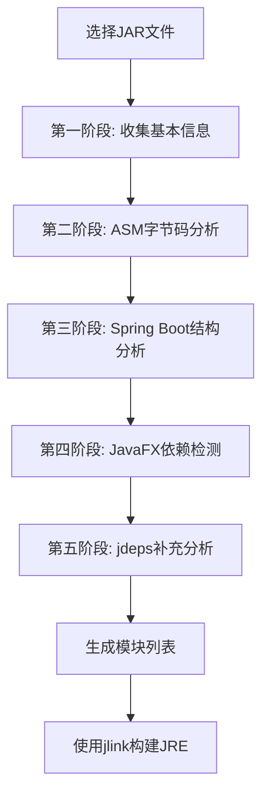

# JRE Generator - Java运行时环境生成工具

<div align="center">


一个强大的Java工具，能够分析JAR文件并生成最小化的自定义JRE运行时环境

[功能特性](#功能特性) • [快速开始](#快速开始) • [使用指南](#使用指南) • [技术原理](#技术原理) • [贡献指南](#贡献指南)

</div>


## 📖 项目介绍

JRE Generator 是一个基于JavaFX的图形化工具，专门用于分析Java应用程序的JAR文件，并生成包含所有必需模块的最小化自定义JRE。该工具通过深度字节码分析和智能模块检测，确保生成的JRE既完整又精简。

### 🎯 解决的问题

- **JRE体积过大**：标准JRE包含大量不必要的模块
- **依赖分析复杂**：手动分析Java模块依赖关系困难
- **部署包臃肿**：应用部署时携带完整JRE导致包体积巨大
- **模块化困难**：Java 9+模块化系统使用复杂

## ✨ 功能特性

### 🔍 智能分析引擎
- **ASM字节码分析**：深度分析所有类文件的依赖关系
- **Spring Boot支持**：专门优化Spring Boot Fat JAR的分析
- **JavaFX检测**：自动识别JavaFX应用并添加相关模块
- **多重保障机制**：ASM分析 + jdeps工具双重保障

### 🎨 用户友好界面
- **现代化UI**：基于JavaFX的响应式用户界面
- **实时进度显示**：详细的分析进度和状态反馈
- **日志输出**：完整的操作日志和错误信息
- **配置持久化**：自动保存和恢复用户配置

### 🚀 高性能处理
- **并发分析**：多线程处理提升分析速度
- **内存优化**：智能内存管理处理大型JAR文件
- **增量分析**：避免重复分析已处理的内容

### 🎯 精准模块检测
- **190+包映射**：覆盖Java标准库的完整包到模块映射
- **第三方库识别**：智能识别和过滤第三方依赖
- **运行时模块**：自动添加运行时动态加载的必需模块

## 🚀 快速开始

### 环境要求

- **Java 17+**：需要完整的JDK（包含jlink工具）
- **JavaFX SDK 17+**：用于界面显示（如果启用JavaFX支持）
- **操作系统**：Windows、macOS、Linux

### 下载安装

1. **从Releases下载**
   ```bash
   # 下载最新版本
   wget https://github.com/zlgg007/JREGenerate/releases/latest/download/JREGenerate.jar
   ```

2. **运行应用**
   ```bash
   java -jar JREGenerate.jar
   ```

### 基本使用

1. **选择JAR文件**：点击"浏览"选择要分析的JAR文件
2. **配置输出目录**：选择自定义JRE的输出位置
3. **设置构建选项**：
   - ✅ 启用压缩（推荐）
   - ✅ 移除调试信息
   - ✅ 不包含手册页
   - ✅ 不包含头文件
4. **开始分析**：点击"分析JAR文件"按钮
5. **构建JRE**：分析完成后点击"构建自定义JRE"

## 📚 使用指南

### 支持的项目类型

| 项目类型 | 支持程度 | 特殊优化 |
|---------|---------|---------|
| 标准Java应用 | ✅ 完全支持 | - |
| Spring Boot应用 | ✅ 完全支持 | 🚀 专门优化 |
| JavaFX应用 | ✅ 完全支持 | 🎨 自动检测 |
| Maven/Gradle项目 | ✅ 完全支持 | - |
| Quarkus应用 | ✅ 完全支持 | - |
| Micronaut应用 | ✅ 完全支持 | - |

### JavaFX应用配置

如果你的应用使用JavaFX：

1. ✅ 勾选"启用JavaFX支持"
2. 📁 选择JavaFX SDK路径
3. 🎯 工具会自动检测并添加必要的JavaFX模块：
   - `javafx.base` - 基础API
   - `javafx.graphics` - 图形和场景图
   - `javafx.controls` - UI控件
   - `javafx.fxml` - FXML支持（如果使用）
   - `javafx.web` - Web组件（如果使用）
   - `javafx.media` - 媒体支持（如果使用）

### 高级配置

#### 🎛️ 构建配置详解

工具提供5个重要的JRE优化选项，帮助你在**文件大小**、**构建时间**和**功能完整性**之间找到最佳平衡：

##### ✅ **启用压缩 (compress)**
- **作用**：对生成的JRE进行压缩，减小文件大小
- **效果**：可将JRE大小减少30-60%
- **推荐**：✅ 生产环境启用
- **jlink参数**：`--compress <level>`

##### 🗑️ **移除调试信息 (stripDebug)**
- **作用**：移除Java字节码中的调试信息（行号、变量名等）
- **效果**：减小JRE大小约10-20%
- **推荐**：✅ 生产环境启用，❌ 开发环境禁用
- **jlink参数**：`--strip-debug`

##### 📖 **不包含手册页 (noManPages)**
- **作用**：移除Unix/Linux系统的man手册页文件
- **效果**：减小JRE大小约5-10MB
- **推荐**：✅ 应用分发时启用
- **jlink参数**：`--no-man-pages`

##### 📄 **不包含头文件 (noHeaderFiles)**
- **作用**：移除C/C++头文件（用于JNI开发）
- **效果**：减小JRE大小约1-3MB
- **推荐**：✅ 纯Java应用启用，❌ JNI开发禁用
- **jlink参数**：`--no-header-files`

##### 🎚️ **压缩级别 (compressionLevel)**
- **选项**：0（无压缩）、1（快速压缩）、2（最佳压缩）
- **默认**：2（推荐生产环境）

| 级别 | 压缩率 | 构建时间 | 启动时间 | 适用场景 |
|------|--------|----------|----------|----------|
| **0** | 无压缩 | 最快 | 最快 | 开发环境 |
| **1** | 中等 | 中等 | 中等 | 平衡选择 |
| **2** | 最高 | 最慢 | 稍慢 | 生产环境 |

#### 📦 **推荐配置方案**

##### 🚀 **生产环境配置**
```
✅ 启用压缩          ✅ 移除调试信息
✅ 不包含手册页      ✅ 不包含头文件
🎚️ 压缩级别: 2
```
**效果**：JRE大小从200MB+减少到50-80MB（减少60-75%）

##### 🔧 **开发环境配置**
```
❌ 启用压缩          ❌ 移除调试信息
✅ 不包含手册页      ✅ 不包含头文件
🎚️ 压缩级别: 0
```
**效果**：保留调试信息，快速构建

##### ⚡ **嵌入式/受限环境**
```
✅ 启用压缩          ✅ 移除调试信息
✅ 不包含手册页      ✅ 不包含头文件
🎚️ 压缩级别: 2
```
**效果**：最小化JRE体积，适合存储受限的环境

#### Spring Boot应用
工具会自动为Spring Boot应用添加运行时必需模块：
- `java.naming` - JNDI支持
- `java.management` - JMX监控
- `java.security.jgss` - Kerberos支持
- `jdk.unsupported` - 内部API访问
- 等23个核心模块

## 🔧 技术原理

### 分析流程



### 核心技术

#### 1. ASM字节码分析
```java
ClassReader classReader = new ClassReader(inputStream);
DependencyCollector collector = new DependencyCollector();
classReader.accept(collector, ClassReader.SKIP_DEBUG | ClassReader.SKIP_FRAMES);
```

**分析内容**：
- 类继承关系（父类、接口）
- 字段类型依赖
- 方法签名和参数类型
- 方法体中的调用关系
- 异常类型和注解引用
- 泛型类型参数

#### 2. 模块映射系统
- **190+包映射**：完整的Java标准库包到模块映射
- **智能推导**：父包匹配和模块推导
- **第三方过滤**：自动识别和忽略第三方库

#### 3. 多重保障机制
- **主要分析**：ASM字节码深度分析
- **特殊处理**：Spring Boot和JavaFX专门优化
- **兜底机制**：jdeps官方工具补充分析

### 性能优化

- **并发安全**：使用`ConcurrentHashMap`处理并发
- **内存管理**：流式处理避免内存溢出
- **进度反馈**：实时显示分析进度
- **异常恢复**：单个类分析失败不影响整体

## 📊 性能数据

| JAR大小 | 类文件数量 | 分析时间 | 生成JRE大小 |
|--------|-----------|---------|------------|
| 50MB | 10,000类 | ~30秒 | ~80MB |
| 100MB | 25,000类 | ~60秒 | ~120MB |
| 200MB | 40,000类 | ~120秒 | ~140MB |

*测试环境：Intel i7-10700K, 16GB RAM, Windows 11*

## 🛠️ 开发构建

### 克隆项目
```bash
git clone https://github.com/zlgg007/JREGenerate.git
cd JREGenerate
```

### 构建项目
```bash
# 使用Maven构建
mvn clean compile

# 运行应用
mvn javafx:run

# 打包JAR
mvn clean package
```

### 项目结构
```
JREGenerate/
├── src/main/java/
│   ├── com/zlgg/analyzer/     # JAR分析器
│   ├── com/zlgg/builder/      # JRE构建器
│   ├── com/zlgg/ui/          # 用户界面
│   ├── com/zlgg/util/        # 工具类
│   └── com/zlgg/model/       # 数据模型
├── src/main/resources/
│   ├── fxml/                 # FXML界面文件
│   └── css/                  # 样式文件
└── pom.xml                   # Maven配置
```

## 🤝 贡献指南

我们欢迎所有形式的贡献！

### 如何贡献

1. **Fork项目** 🍴
2. **创建特性分支** (`git checkout -b feature/AmazingFeature`)
3. **提交更改** (`git commit -m 'Add some AmazingFeature'`)
4. **推送分支** (`git push origin feature/AmazingFeature`)
5. **创建Pull Request** 🚀

### 贡献类型

- 🐛 **Bug修复**：修复已知问题
- ✨ **新功能**：添加新特性
- 📚 **文档改进**：完善文档和示例
- 🎨 **UI优化**：改进用户界面
- ⚡ **性能优化**：提升分析速度

## 📝 更新日志

### v1.0.0 (2025-01-XX)
- ✨ 首个正式版本发布
- 🔍 完整的ASM字节码分析
- 🚀 Spring Boot专门支持
- 🎨 JavaFX智能检测
- 📱 现代化用户界面

## ❓ 常见问题

<details>
<summary><strong>Q: 生成的JRE能在其他机器上运行吗？</strong></summary>

A: 可以，但需要注意：
- 目标机器的操作系统架构必须匹配
- 如果使用了本地库，需要确保目标机器有相应的依赖
</details>

<details>
<summary><strong>Q: 为什么分析Spring Boot应用需要这么长时间？</strong></summary>

A: Spring Boot Fat JAR包含了所有依赖（通常4万+类文件），需要逐个分析每个类的依赖关系。这是为了确保生成最精确的模块列表。
</details>

<details>
<summary><strong>Q: 支持Java 8的应用吗？</strong></summary>

A: 不支持。本工具基于Java 9+的模块系统，只能为Java 9+的应用生成自定义JRE。
</details>

## 📄 许可证

本项目基于 [MIT License](LICENSE) 开源协议。

## 🙏 致谢

- [ASM](https://asm.ow2.io/) - Java字节码操作框架
- [JavaFX](https://openjfx.io/) - 现代Java用户界面工具包
- [Spring Boot](https://spring.io/projects/spring-boot) - Java企业级应用框架
- [Hutool](https://hutool.cn/) - Java工具类库

---

<div align="center">

**如果这个项目对你有帮助，请给它一个 ⭐！**

[报告Bug](https://github.com/zlgg007/JREGenerate/issues) • [请求功能](https://github.com/zlgg007/JREGenerate/issues) • [讨论交流](https://github.com/zlgg007/JREGenerate/discussions)

</div> 
